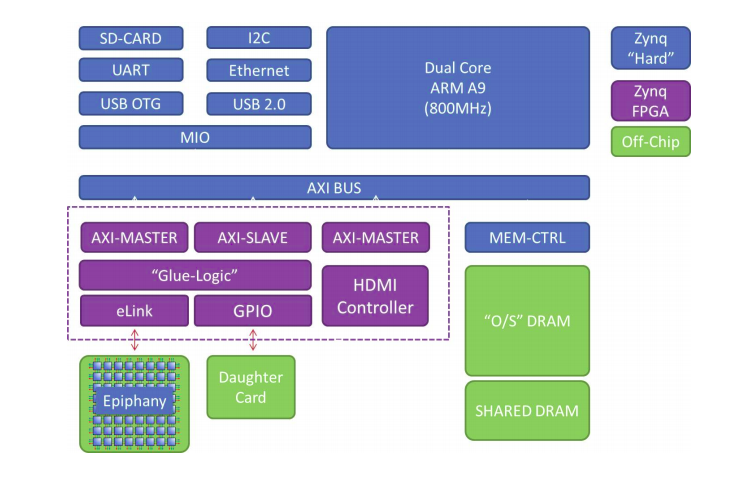

Adapteva Parallella
===================

The Parallella hardware is based on Epiphany multicore chip developed by `Adapteva`_.
The Epiphany hardware `E16G301`_ used for this project is a 16-Core System-On-Chip 
implemented in a 65nm based on third generation of Epiphany Multicore IP. The high 
speed inter-processor communication is based on Epiphany architecture's Network-on
-Chip(NOC). Each node consists of a RISC CPU, DMA Engine, Memory and Network Interface
and operates at a frequency of 700 MHz.

The board also includes Zynq Dual Core ARM A9 processor with 1 GB of SDRAM. Since the 
Epiphany cores are bare bone processors, access to these cores are enabled through the
ARM processor. However, real time operating systems such as FreeRTOS can be ported on 
the Epiphany cores. The main application is executed on the ARM(Host) processor, which
interacts with the Epiphany cores by reading and writing to the shared memory area.

Hardware Specification
-------------------------
Below are overview of the Adapteva Parallella for hardware specification. 

* zynq-7000 Series Dual-core ARM A9 CPU (Z-7010 or Z-7020)
* 16 or 64-core Epiphany Multicore Accelerator
* 1GB RAM
* MicroSD Card
* 2x USB 2.0
* 4 general purpose expansion connectors
* 10/100/1000 Ethernet
* HDMI port
* Linux Operating System

Establishing connection with the Board
--------------------------------------

The parallella board comes with the support of SD Card slot and ethernet port.
The board terminal can be accessed via the host computer using the SSH connection.
The steps to establish the connection between the host computer and the Parallella 
board can be found at this `link`_. 

.. _Adapteva : https://www.adapteva.com/parallella/
.. _E16G301 : https://www.adapteva.com/docs/e16g301_datasheet.pdf
.. _link : http://www.parallella.org/docs/parallella_manual.pdf

