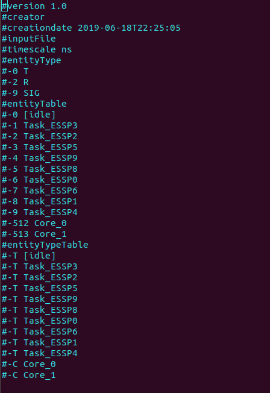
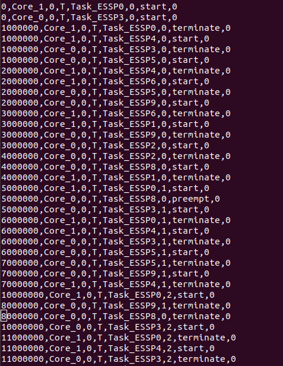

BTF Specification
=================

This chapter explain the basic structure and specification of Best Trace Format. It also
provides the information about basic specifications incorporated in the tracing framework
from the standard BTF Specification. The implementation of the BTF tracing framework is 
based on the specification defined in `Eclipse wiki`_ by Timing Architect.

.. _btf_spec:

BTF Structure
-------------

The BTF file consists of two parts:

1. All header section, containing information on objects of the trace and optional comments.
2. A data-section, containing the trace data of the simulation or measurement.

Header Section
~~~~~~~~~~~~~~

The header includes parameters, used for the interpretation of the trace or information of the trace
generator, and comments. Parameters and comments are indicated by a ‘#’-symbol.

The typical header of a BTF-file includes at least the version, creator, creation date and the time scale.
Further information is optional.

The above image demonstrates the BTF header section generated by the tracing framework implemented over
RTFParallella. It shows the version, creator, creation date, time scale and Amalthea model file name used for
for simulation over Adapteva Parallella. It also lists the entity type which corresponds to the events and
lists the tasks and core information. This forms the metadata of the BTF header section.

Data Section
~~~~~~~~~~~~

The trace information is represented in CSV format. Each line describes one event. The interpretation of
one line depends on the event type.

The data section consists of line by line interpreted data. Each line has eight columns, whereas the last
column is optional. A line contains the following elements:

*<Time>,<Source>,<SourceInstance >,<TargetType>,<Target>,<TargetInstance>,<Event>,<Note>*

The time corresponds to the nano second scale factor in order to comply with Eclipse Trace Compass. 

Supported Entities and Events
-----------------------------

The BTF trace format supports multiple entities and events and is based  on the OSEK Architecture.
However, the developed tracing framework does not support the BTF specification in its entirety.
This sections provides information about the supported entities and events in the tracing framework.

* PROCESS EVENTS (TASK and ISR EVENTS)

  A process can be either a task or an interrupt service routine. A scheduler assigns the process to 
  a core where the process is executed. A running process can be preempted by another process which is 
  of higher priority. The process resumes its execution once the higher priority task is executed.

  +----------------+----------------------------------------------------------------------+--------+
  | Internal Event |                                Description                           | Source |
  +================+======================================================================+========+
  |      START     |  Process instance is allocated to the core and starts its execution  |  Core  |
  +----------------+----------------------------------------------------------------------+--------+
  |     PREEMPT    |         Executing process instance is stopped by the scheduler       |  Core  |
  +----------------+----------------------------------------------------------------------+--------+
  |     RESUME     | Preempted process instance continues execution on same or other core |  Core  |
  +----------------+----------------------------------------------------------------------+--------+
  |    TERMINATE   |                 Process instance has finished execution              |  Core  |
  +----------------+----------------------------------------------------------------------+--------+

* RUNNABLE EVENTS

  A Runnable event is an atomic task executed within a Task Event. A task consists of multiple Runnables.
  A runnable is called within a process instance or in the context of another runnable.

  +----------------+----------------------------------------------------------------------+----------+
  | Internal Event |                                Description                           |  Source  |
  +================+======================================================================+==========+
  |      START     | Runnable instance is allocated to the core and starts its execution  |  Process |
  +----------------+----------------------------------------------------------------------+----------+
  |     SUSPEND    | Executing runnable instance is suspended as calling process preempts |  Process |
  +----------------+----------------------------------------------------------------------+----------+
  |     RESUME     | Suspended runnable instance continue execution on same or other core |  Process |
  +----------------+----------------------------------------------------------------------+----------+
  |    TERMINATE   |                Runnable instance has finished execution              |  Process |
  +----------------+----------------------------------------------------------------------+----------+

* SIGNAL EVENTS

  A signal is a label, which can be accessed by a process instance. 

  +----------------+----------------------------------+-----------+
  | Internal Event |             Description          |  Source   |
  +================+==================================+===========+
  |       READ     |    Signal is read by a process   |  Process  |
  +----------------+----------------------------------+-----------+
  |       WRITE    |  Signal is written by a process  |  Process  |
  +----------------+----------------------------------+-----------+

.. _Eclipse wiki : https://wiki.eclipse.org/images/e/e6/TA_BTF_Specification_2.1.3_Eclipse_Auto_IWG.pdf
