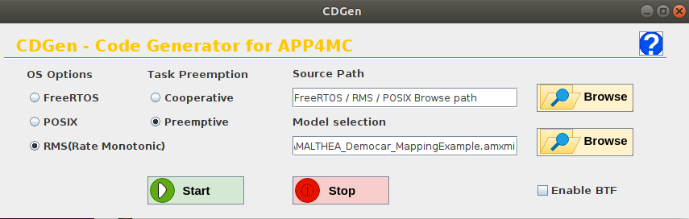

CdGen Feature Extension
=======================

Overview
--------

The CdGen is an application which can be used to generate the code based on the provided Amalthea task model on different hardware platforms. It also provides the support for generating the code over various scheduler's such as FreeRTOS, POSIX and Rate Monotonic Scheduler. The RTFParallella follows Rate Monotonic Scheduling which is built on top of FreeRTOS. It also allows preemption of lower prority tasks when a higher priority starts its execution. The tracing framework has been added as a feature extension to this application which allows the user to generate the code for the provided task model along with the tracing framework. It enhances the cost-effectiveness and decreases the chances of error when compared to manual coding.

Tracing Framework on CdGen
---------------------------

A new check box has been added to the CdGen GUI for the BTF trace framwork code generation which is labelled as **Enable BTF**.

The check box needs to be checked in order to generate the tracing framework code. As the tracing framework is an extension to RTFParallella, it follows RMS scheduling approrach. Therefore, the check box is functional only when the radio button of RMS(Rate Monotonic) is set.

The feature extension to the CdGen application must comply with the code base of the RTFParallella framework. As part of the development new modules has been added to the CdGen application which includes generating the RTFParallella Config header file and also generating the model enumeration file which contains the information about the tasks, runnables, shared labels and hardware cores used in the Amalthea task model. The tasks created in RMS file is also based on the priority which makes the simulation of the task model more deterministic.

Usage
-----

* Select checkFileCreateGUI.java in checks folder and Run as Java application
* Select the scheduler(RMS), task preemption, file source of corresponding scheduler and Model of choice.
* Check the Enable BTF check box.
* Click start for code generation.
* Manually copy the generated code to the latest RTFParallella framework having tracing framework functionality.
* Build, deploy and Run the code on Parallella.

