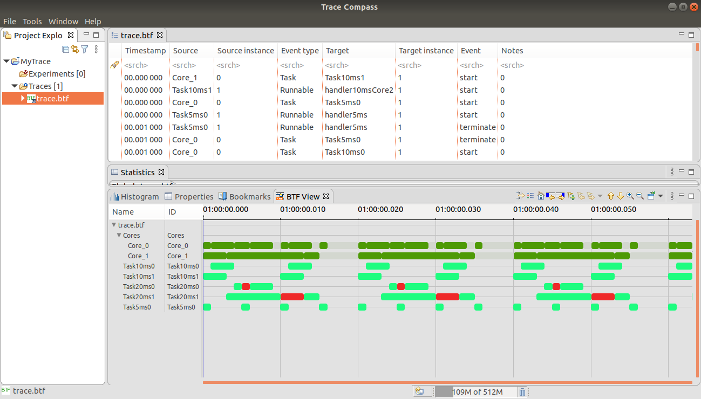
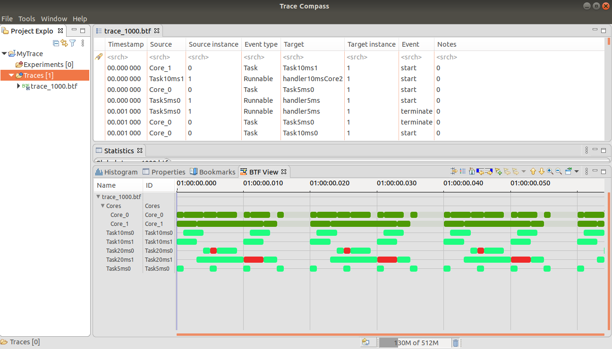

Amalthea Model Example
======================

This page describes the example amalthea model implemented in RTFParallella using trace framework.

The implementation of this example can be found in `core0_main.c` and `core1_main.c` source files.

Th example for visualizing this model using the host processor are also provided in `host_example1.c`.

Overview
------------------------------------------

The model implemented in this example has the following attributes:

+-----------------------+----+
| Number of cores       | 2  |
+-----------------------+----+
| Number of tasks       | 5  |
+-----------------------+----+
| Number of event chains| 1  |
+-----------------------+----+

The tasks implemented in this core have the following attributes:

+-----------------------+-------------+------+----------+--------------+
| Task name             | task period | WCET | deadline | core mapping |
+=======================+=============+======+==========+==============+
| task5ms0              | 5  mS       | 1 mS |   5 mS   | Core 0       |
+-----------------------+-------------+------+----------+--------------+
| task10ms0             | 10 mS       | 3 mS |  10 mS   | Core 0       |
+-----------------------+-------------+------+----------+--------------+
| task20ms0             | 20 mS       | 4 mS |  20 mS   | Core 0       |
+-----------------------+-------------+------+----------+--------------+
| task10ms1             | 10 mS       | 3 mS |  10 mS   | Core 1       |
+-----------------------+-------------+------+----------+--------------+
| task20ms1             | 20 mS       | 9 mS |  20 mS   | Core 1       |
+-----------------------+-------------+------+----------+--------------+

The used cores are mapped on Epiphany cores as follows:

+-------------------+---------------------+------------------------+
| Core name         | Epiphany device row | Epiphnay device column |
+===================+=====================+========================+
| Core0             |         0           |           0            |
+-------------------+---------------------+------------------------+
| Core1             |         1           |           0            |
+-------------------+---------------------+------------------------+

Results
--------

The above task model is simulated on Parallella hardware platform. The generated BTF trace file can be viewed on *Eclipse Trace Compass*.
Below is the resultant trace file viewed on Eclipse Trace Compass with the time scale factor of 100us.

Below is the resultant trace file viewed on Eclipse Trace Compass with the time scale factor of 1000us.

