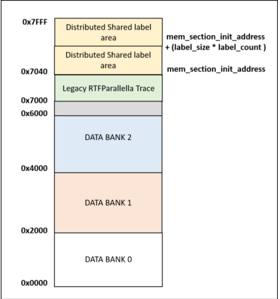
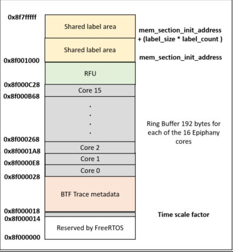

Memory Mapping
==============

The Epiphany architecture uses a single, flat address space consisting of 2^32 8-bit bytes.
However, the overall memory architecture on Parallella is divided in two sections. One which
which is internal to the each core and the other which is shared among the cores.

Internal Memory
---------------

Each Epiphany core has an internal memory of 32 KB. This memory section is further divided into 
four memory banks. The memory section starts with the offset of 0x0000 and extends until 0x7FFF.
Each memory bank is equally divided and comprises of 8 KB. The memory access between core to core
is also possible by using the global address space. The first 3 bytes in the address space defines
the core id of the epiphany core followed by 5 bytes of local address. Therefore, the global address
space of each core range from 0x???00000 - 0x???07FFF. The same address range can be used by the Host
processor to access the Epiphany core memory.

The trace framework has defined the address space for creating an application on top of it. It is
recommended to use this address space when any application is developed on RTFParallella with the
tracing framework. However, the memory mapping can be configured by changing the memory offsets in
the RTFParallella config header file.

The below image shows the address mapping for the RTFParallella with tracing framework enabled:

Besides, the below API can be used to get the memory pointer from the address space of Epiphany core
in the application code of the Epiphany core:

.. code-block:: CPP

    unsigned int *allocate_epiphany_memory(unsigned int offset);

External Memory
---------------

The external memory is defined in the address range of 0x8E000000 - 0x8FFFFFFF. The size of the external 
memory is 32 MB. The first 16MB of memory region is reserved for the C libraries, code and data stack.
The next 16 MB is further divided into two memory sections of 8 MB each. They form the *shared_dram* and 
*heap_dram* section.

In the implemented framework, the memory region of *shared_dram* is used to for storing the BTF trace and 
shared label data. The below figure demonstrates the memory region of shared_dram area:

The below API can be used to get the memory pointer from the address space of *shared_dram* memory region
in the application code of the Epiphany core:

.. code-block:: CPP

    unsigned int *allocate_shared_memory(unsigned int offset);

Notes
-----

The information provided above also depends on the linker script that is being used. The defined memory address space is based on the **fast.ldf** linker script.
